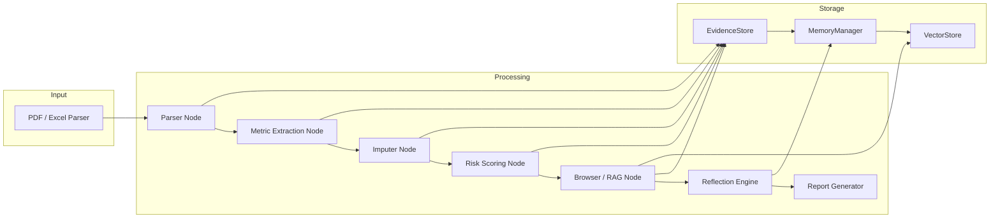

# Architecture Diagram

Below is a high-level architecture of the Financial Report Analysis Skill.

Notes:
- The graph is assembled via `graph/create_finance_graph` and executed by `main.py`.
- External web evidence (RAG/MCP) is compressed, persisted to `EvidenceStore`, and optionally added to vector index.
- A lightweight LangGraph SQLite checkpoint is saved per `thread_id` during execution under `workspace/cache/langgraph_checkpoint_<thread_id>.sqlite`; different threads are isolated by file.
- Reflection emits per-evaluator scores and blocking reasons; it intentionally does not force an aggregate score when evidence is incomplete.
